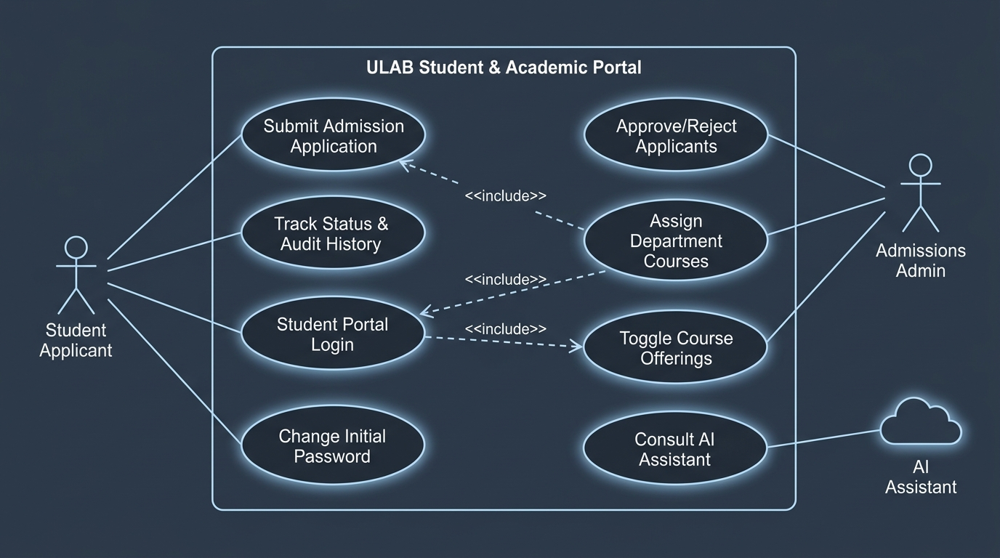
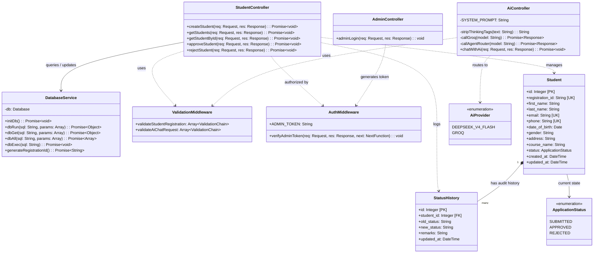
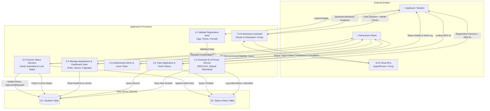
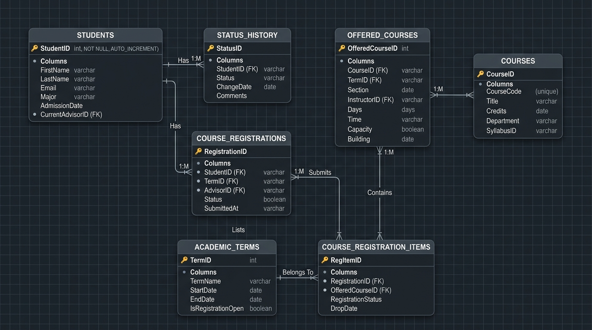
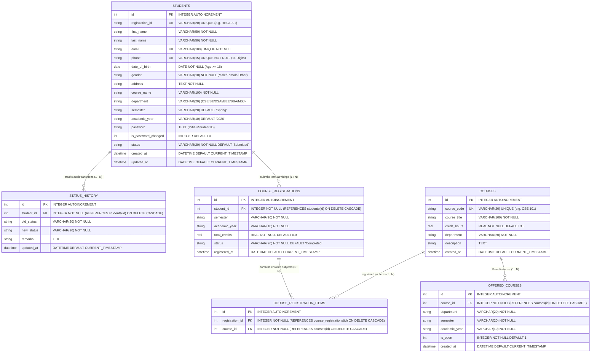
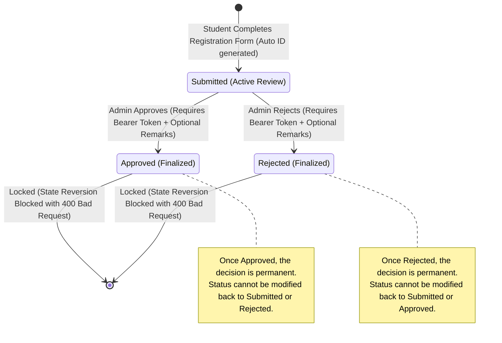

# System Architecture & Design Diagrams
**Project:** Student Registration & Admission Management System  
**Institution:** University of Liberal Arts Bangladesh (ULAB)  
**Stack:** Node.js, Express.js, SQLite (WAL mode), Tailwind CSS, Vanilla JS, DeepSeek-v4-flash, Groq API  

---

## 📑 Table of Contents
1. [Use Case Diagram](#1-use-case-diagram)
2. [Class Diagram (Architecture & Object Models)](#2-class-diagram)
3. [Data Flow Diagram - Level 0 (Context Diagram)](#3-data-flow-diagram-level-0-context-diagram)
4. [Data Flow Diagram - Level 1 (Detailed Subsystems)](#4-data-flow-diagram-level-1-detailed-processes)
5. [Entity-Relationship (ER) Diagram](#5-entity-relationship-er-diagram)
6. [Application State Machine Diagram](#6-application-state-machine-diagram)

---

## 1. Use Case Diagram

The Use Case Diagram captures the interactions between external actors (**Applicant / Student**, **Approved Student**, **Admissions Administrator**, and **External AI Gateway**) and the core subsystems of the ULAB portal.

### Visual Diagram:

*(High-definition vector version available at [`docs/use_case_diagram.svg`](file:///d:/web%20project/1st/docs/use_case_diagram.svg))*

```mermaid
flowchart TD
    %% Actors
    Applicant(("🧑 Applicant / Public"))
    ApprovedStudent(("🎓 Approved Student"))
    Admin(("🔐 Admissions Admin"))
    AiService(("🤖 AI LLM Gateway<br/>(DeepSeek / Groq)"))

    %% Subsystem Boundary
    subgraph SystemBoundary ["ULAB Student Registration & Academic Portal"]
        %% Public Admission Use Cases
        UC1(["Submit Online Admission Application"])
        UC2(["Validate Input Data<br/>(Age >= 16, 11-digit Phone, Unique Email)"])
        UC3(["Track Application Status by REG ID"])
        UC4(["Inquire with AI Admissions Bot"])

        %% Student Portal & Advising Use Cases
        UC5(["Student Portal Login<br/>(Verified Approved Status)"])
        UC6(["Mandatory Initial Password Change"])
        UC7(["View Student Profile & Details"])
        UC8(["Register Semester Courses"])
        UC9(["Enforce Credit Limit<br/>(Max 15.0 Credits)"])
        UC10(["Generate & Print Advising Slip"])

        %% Admin Management Use Cases
        UC11(["Authenticate Admin<br/>(Bearer Token Issuance)"])
        UC12(["View Dashboard & Metrics"])
        UC13(["Approve Application<br/>(Auto-Generate Credentials)"])
        UC14(["Reject Application<br/>(Add Admin Remarks)"])
        UC15(["Manage Approved Students Roster"])
        UC16(["Manage University Course Catalog"])
        UC17(["Assign Department Course Offerings"])
        UC18(["Toggle Course Offering Availability"])
    end

    %% Applicant Relationships
    Applicant --> UC1
    Applicant --> UC3
    Applicant --> UC4

    %% Approved Student Relationships
    ApprovedStudent --> UC5
    ApprovedStudent --> UC7
    ApprovedStudent --> UC8
    ApprovedStudent --> UC10

    %% Admin Relationships
    Admin --> UC11
    Admin --> UC12
    Admin --> UC13
    Admin --> UC14
    Admin --> UC15
    Admin --> UC16
    Admin --> UC17
    Admin --> UC18

    %% Include Relationships
    UC1 -.->|<<include>>| UC2
    UC5 -.->|<<include>>| UC6
    UC8 -.->|<<include>>| UC9

    %% AI Service Relationships
    UC4 <--> AiService
```



---

## 2. Class Diagram

The Class Diagram illustrates the structural blueprint of the system, including API controllers, middleware functions, database helpers, entities, and relationships.



---

## 3. Data Flow Diagram: Level 0 (Context Diagram)

The Context Diagram defines the external boundaries, environmental entities, and high-level input/output data flows interacting with the admission system.

```mermaid
flowchart TD
    Student["🧑 Applicant / Student"]
    Admin["🔐 Admissions Administrator"]
    System(("0.0<br/>ULAB Student Registration<br/>& Admission System"))
    AiGateway["🌐 External AI Gateway<br/>(AgentRouter / Groq Cloud)"]

    %% Student Data Flows
    Student -->|1. Registration Form Data (Demographics, Program)| System
    Student -->|2. Status Lookup Request (REG ID)| System
    Student -->|3. AI Admission Inquiry (Question + Selected Model)| System

    System -->|4. Confirmation with Generated Registration ID| Student
    System -->|5. Real-Time Application Status & Audit History| Student
    System -->|6. AI Grounded Answer & Guidance| Student

    %% Admin Data Flows
    Admin -->|7. Admin Credentials (spetrum / admin123)| System
    Admin -->|8. Query / Filter Parameters (Status, Search, Page)| System
    Admin -->|9. Status Decision (Approve / Reject + Remarks)| System

    System -->|10. Authentication Bearer Token| Admin
    System -->|11. Paginated Student Records & Metric Stats| Admin
    System -->|12. Action Confirmation & Updated Audit Log| Admin

    %% AI Gateway Data Flows
    System -->|13. Prompt Payload (System Context + Messages)| AiGateway
    AiGateway -->|14. Completion Response / Reasoning| System
```

---

## 4. Data Flow Diagram: Level 1 (Detailed Processes)

Level 1 breaks down the main system into specific sub-processes and data stores.



---

## 5. Entity-Relationship (ER) Diagram

Detailed database structure depicting primary keys, unique constraints, foreign keys, and indexes across all 6 relational tables.

### Visual Diagram:

*(High-definition vector version available at [`docs/er_diagram.svg`](file:///d:/web%20project/1st/docs/er_diagram.svg))*



### Database Constraints & Rules
1. **Primary & Foreign Keys:**
   * `students.id` is the primary key for enrolled students.
   * `status_history.student_id` references `students.id` with `ON DELETE CASCADE`.
   * `offered_courses.course_id` references `courses.id` with `ON DELETE CASCADE`.
   * `course_registrations.student_id` references `students.id` with `ON DELETE CASCADE`.
   * `course_registration_items.registration_id` references `course_registrations.id` with `ON DELETE CASCADE`.
   * `course_registration_items.course_id` references `courses.id` with `ON DELETE CASCADE`.
2. **Unique Constraints:**
   * `students.registration_id`, `students.email`, `students.phone`
   * `courses.course_code`
   * `offered_courses(course_id, department, semester, academic_year)`
   * `course_registrations(student_id, semester, academic_year)` (blocks duplicate advising in same semester)
   * `course_registration_items(registration_id, course_id)`
3. **Indexes Created:**
   * `idx_students_status` on `students(status)`
   * `idx_students_registration` on `students(registration_id)`
   * `idx_students_email` on `students(email)`
   * `idx_courses_dept` on `courses(department)`
   * `idx_offered_dept_sem` on `offered_courses(department, semester, academic_year)`

---

## 6. Application State Machine Diagram

The state machine demonstrates the irreversible lifecycle workflow of an application.


